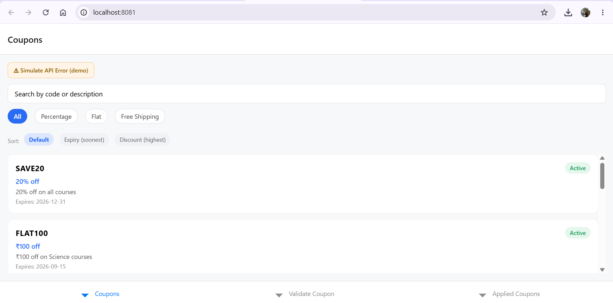
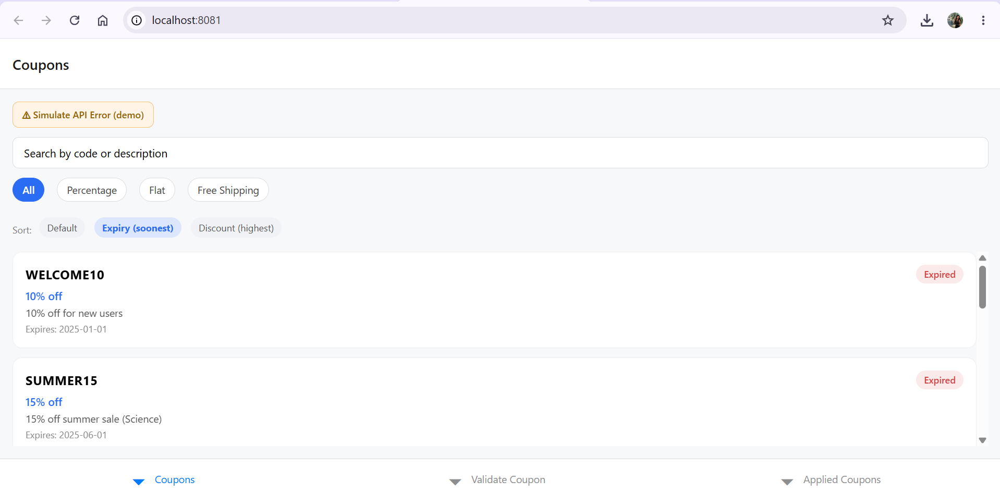
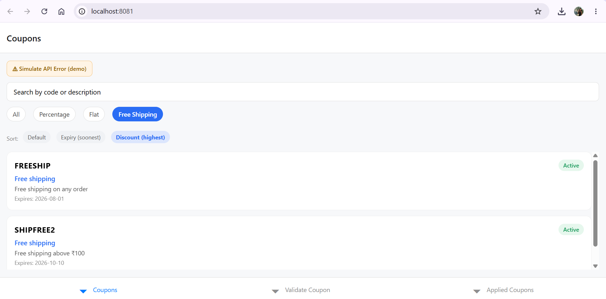
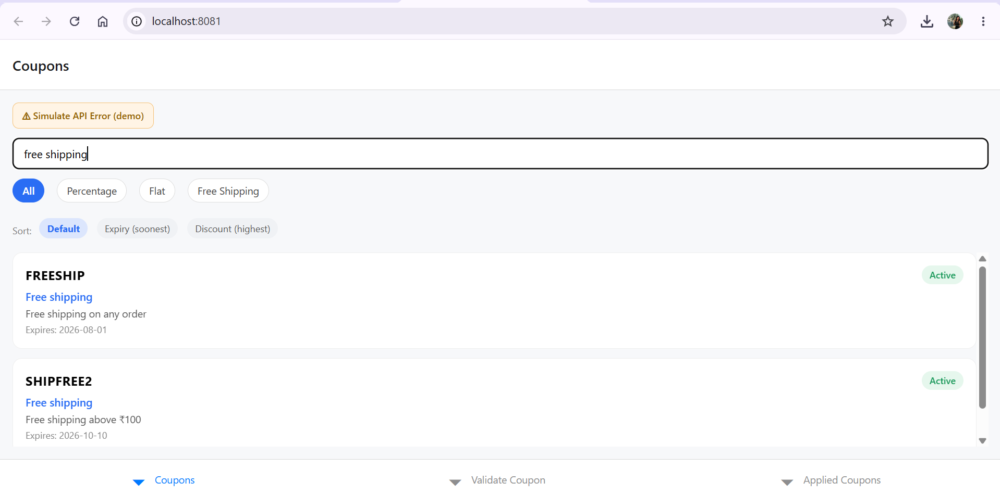
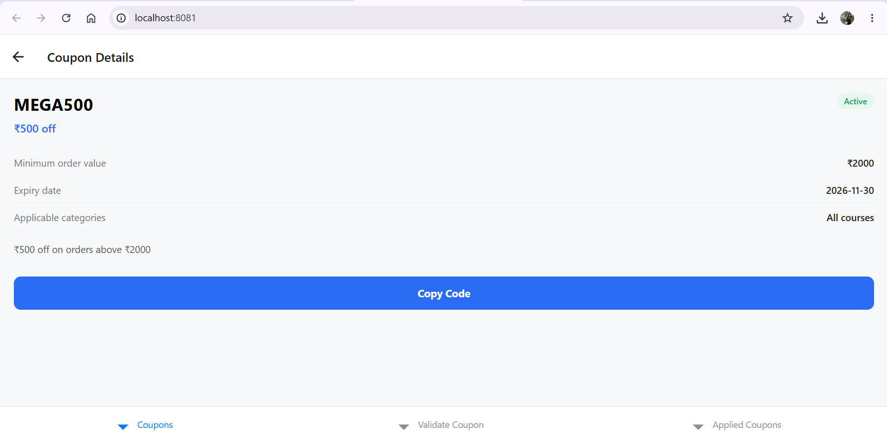
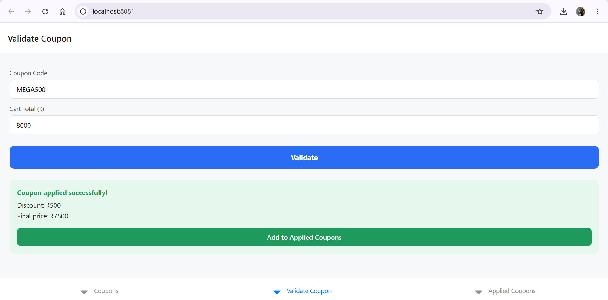
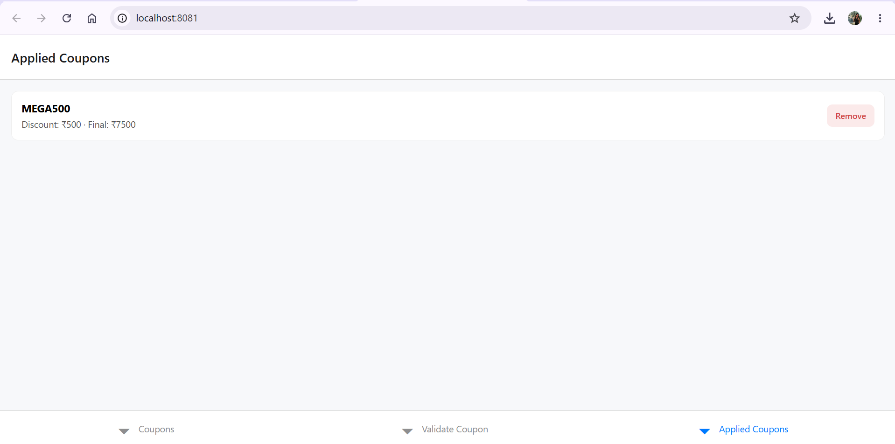

# Coupon Engine


This is my submission for the React Native App Development Intern case study. It's a small app for browsing discount coupons, checking their details, and validating a coupon code against a cart total — basically the coupon section you'd find inside a shopping or edtech app.

**Contents:** [Features](#whats-in-the-app) · [Tech stack](#tech-stack) · [Running it](#running-it-yourself) · [Screenshots](#screenshots) · [Project structure](#how-i-structured-the-project) · [AI usage](#ai-assisted-development) · [What I'd improve](#what-id-improve-with-more-time)

## Tech stack

- **React Native** + **Expo** (SDK 51)
- **React Navigation** — bottom tabs + native stack
- **expo-clipboard** — for the "Copy Code" button
- **React Context** — for sharing applied-coupon state across screens
- **Jest** + **jest-expo** — unit tests for the validation logic
- **GitHub Actions** — CI, runs tests on every push

## What's in the app

Mapped against the assignment's requirements:

| Requirement | Where it lives |
|---|---|
| Coupon list + search + filter | `CouponListScreen.js` |
| Status badge (Active/Expired) | `StatusBadge.js`, derived in `couponValidation.js` |
| Coupon detail + copy to clipboard | `CouponDetailScreen.js` |
| Validator (code + cart total → discount/error) | `CouponValidatorScreen.js` + `couponValidation.js` |
| Applied coupons (session state, removable) | `AppliedCouponsScreen.js` + `AppliedCouponsContext.js` |
| Loading / error / empty states | `CouponListScreen.js` |
| Invalid/expired state in validator | `CouponValidatorScreen.js` |

A few things beyond the base spec that I added on my own:
- **Sort** by soonest expiry or highest discount
- **Pull-to-refresh** on the coupon list
- A **"Simulate API Error"** button, so the error state is actually demoable instead of just being dead code that only fires if the mock API happens to fail
- **Accessibility labels** on all interactive elements (buttons, inputs, cards) so it works properly with a screen reader
- **Unit tests** + a **CI workflow** that runs them automatically

I know the UI isn't meant to be pixel-perfect for this assignment, so I focused more on getting the logic, structure, and states right.

## Running it yourself

You'll need Node.js installed, and the Expo Go app on your phone if you want to test it on a real device (not required — it also runs in a browser).

```bash
npm install
npx expo start
```

Scan the QR code with Expo Go, or press `w` in the terminal to open it in your browser instead.

If you want to preview it in the browser and haven't already installed the web-specific packages, run this once:
```bash
npx expo install react-native-web react-dom @expo/metro-runtime
```

### Running the tests

I wrote unit tests for the coupon validation logic (the part I cared most about getting right):
```bash
npm test
```
There's also a GitHub Actions workflow set up so these run automatically on every push — you can check the Actions tab on this repo to see them pass.

## Screenshots

**Coupon list — default view, with search, filter, sort, and the error-demo button**


**Sorted by soonest expiry** — surfaces the expired coupons first


**Filtered to Free Shipping, sorted by highest discount**


**Search in action**


**Coupon detail screen**


**Validator — successful validation with discount and final price**


**Applied Coupons screen**


## How I structured the project

```
coupon-engine/
├── App.js
├── src/
│   ├── data/mockCoupons.js          — the mock "API" (hardcoded data + a setTimeout-based fetch)
│   ├── utils/couponValidation.js    — all validation/discount logic, kept separate from any screen
│   ├── context/AppliedCouponsContext.js — shared state for applied coupons
│   ├── components/                  — CouponCard, StatusBadge (reused in more than one place)
│   ├── screens/                     — one file per screen
│   └── navigation/AppNavigator.js   — bottom tabs + a stack for the coupon detail screen
```

I split things this way mainly so each piece only does one job. The mock API lives on its own so swapping it for a real backend later would just mean changing what's inside `fetchCoupons`, not touching any screen. The components folder only has things that are actually reused (the card and the badge) — I didn't want to over-abstract single-use bits of UI into their own files just for the sake of it.

**Where I put the validation logic, and why:** all of it lives in `src/utils/couponValidation.js`, as plain functions with no React or navigation code anywhere near them. I did this on purpose — it means I could write real unit tests against it without needing to render a component, and if this same validation ever needed to run somewhere else (say, a checkout screen down the line), it's just one import away instead of copy-pasted logic scattered across screens. It also makes the business rules easy to find in one place instead of hunting through UI code.

**If there were a real backend:** I'd move `validateCoupon` server-side and have the Validator screen just call an API instead (`POST /coupons/validate` with the code and cart total), but keep the same response shape (`valid`, `reason`, `discountAmount`, `finalPrice`) so I wouldn't have to rewrite the screen itself — only swap what's calling it. Validating client-side only is fine for a case study, but in a real app it'd mean the rules could be bypassed or go stale if the app isn't updated alongside a promotion, and usage-limit tracking per user (excluded from this assignment) would also have to live on the server anyway.

## AI-assisted development

I used **Claude** (Anthropic) quite a bit for this — mainly to move faster on the Expo/React Native setup since I hadn't worked with React Native before, and I'm more used to plain React.

Some of the things I actually asked it for:
- To scaffold the initial Expo project with React Navigation and expo-clipboard already wired up, since I didn't know the exact setup steps for a fresh RN project
- To write the pure validation functions (expired check, minimum order check, discount calculation for each coupon type) as testable functions rather than logic buried in a screen
- Help setting up a GitHub Actions workflow to run the tests automatically, which I hadn't done before

**Where it helped most:** the initial project scaffolding and folder structure — that's the part that would've taken me the longest to figure out on my own without prior React Native experience. It also helped me write proper unit tests, which I hadn't written for a React Native project before.

**What I actually did myself:** I read through every file it generated rather than just copying it in blindly, and ran the app after each screen was added instead of waiting until the end. I added the pull-to-refresh behaviour, the disabled/loading state on the Validate button, and the "Simulate API Error" button myself once I noticed the error state existed in code but had no way to actually trigger it — that felt like an important gap to close for a working demo, not just working code. I also set up the actual GitHub repo, dealt with Git for the first time properly (including sorting out a merge conflict from an earlier accidental upload), and tested everything manually on both a browser and my phone.

**How I checked it actually works:** `npm test` runs the unit tests covering valid coupons, expired coupons, coupons below the minimum order value, unknown codes, and discount math for percentage/flat/free-shipping types. On top of that I manually tested every screen — searching and filtering the list, copying a code from the detail screen, running the validator against a mix of the valid and expired test coupons, and applying/removing coupons on the Applied tab.

## What I left out on purpose

Per the assignment, I didn't add authentication, real payment/checkout, an admin panel, push notifications, or backend usage-count tracking.

## What I'd improve with more time

- Move to TypeScript, at least for `couponValidation.js` — the input/output shapes are simple enough that types would catch mistakes early and make the functions self-documenting
- Persist applied coupons with `AsyncStorage` so they survive an app restart, instead of resetting every session
- Add component-level tests (not just the validation logic) using `@testing-library/react-native`
- A proper design pass — right now it's functional but fairly plain, and I'd like to spend more time on visual polish if this were a real product rather than a case study
